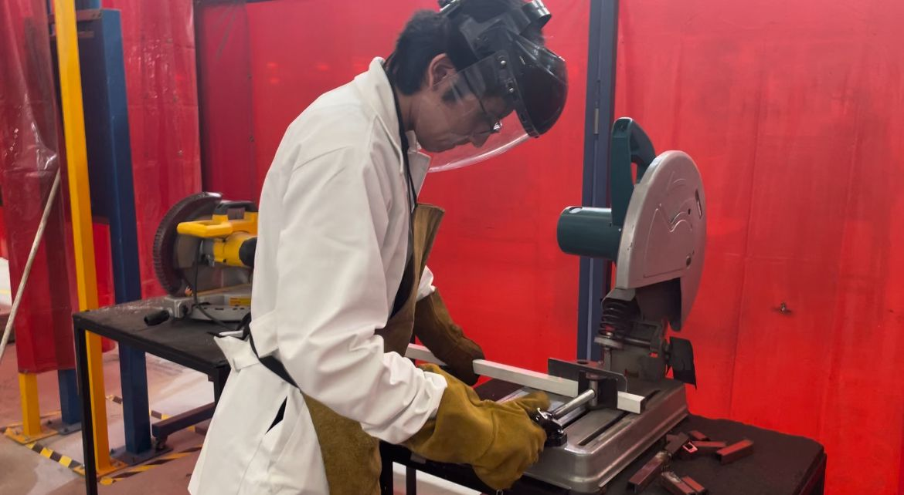
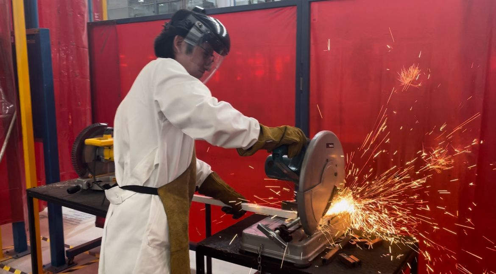
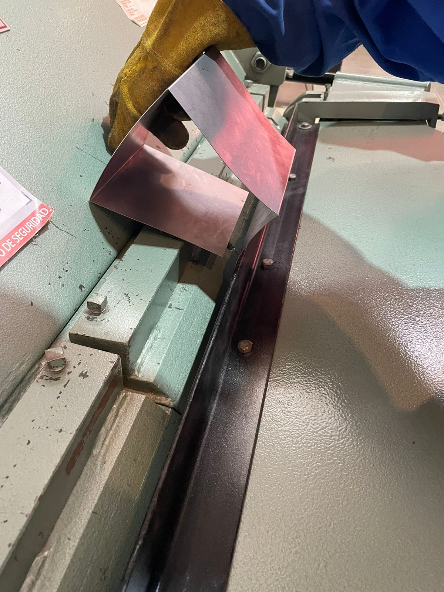

# Uso de maquinaria en el Instituto de Inovación Tecnológica

En este apartado se mostraran los trabajos realizados en las máquinas del IDIT, junto con la evidencia fotogáfica del uso de las máquinas.

Este proceso fue con la intención de realizar un porta celulares de madera.

## Resultado de las piezas ya ensambladas

[Pieza 1]([https://drive.google.com/file/d/1TP4MWufci7xxggRZrP1k8jUZH3l3B075/view?usp=drive_link](https://drive.google.com/file/d/1GMBlOc8xHObY8KD-FCoPkLazmST_wy9Y/view?usp=sharing))

## Vistazo más detallado de las piezas

## Evidencia del uso de la máquina

