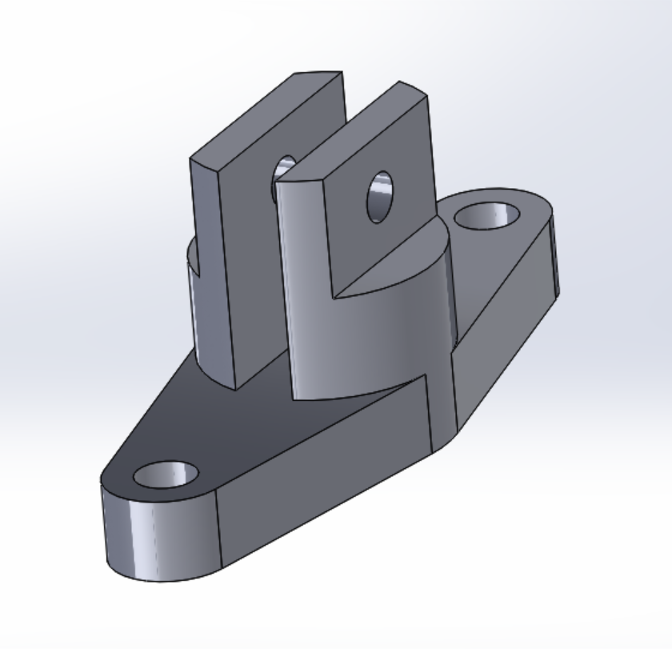

# Piezas en SolidWorks

Dentro del programa de Solid Works, se realizaron múltiples piezas utilizando herramientas, desde la realización y diseño del plano 2d, hasta la extrusión a 3d.
A continuación se mostrarán todas las piezas realizadas:

## Pieza 1
  

## Pieza 2

## Pieza 3
  

## Pieza 4
  

## Pieza Tarea 1
  

## Pieza tarea 2

## Pieza tarea 3

