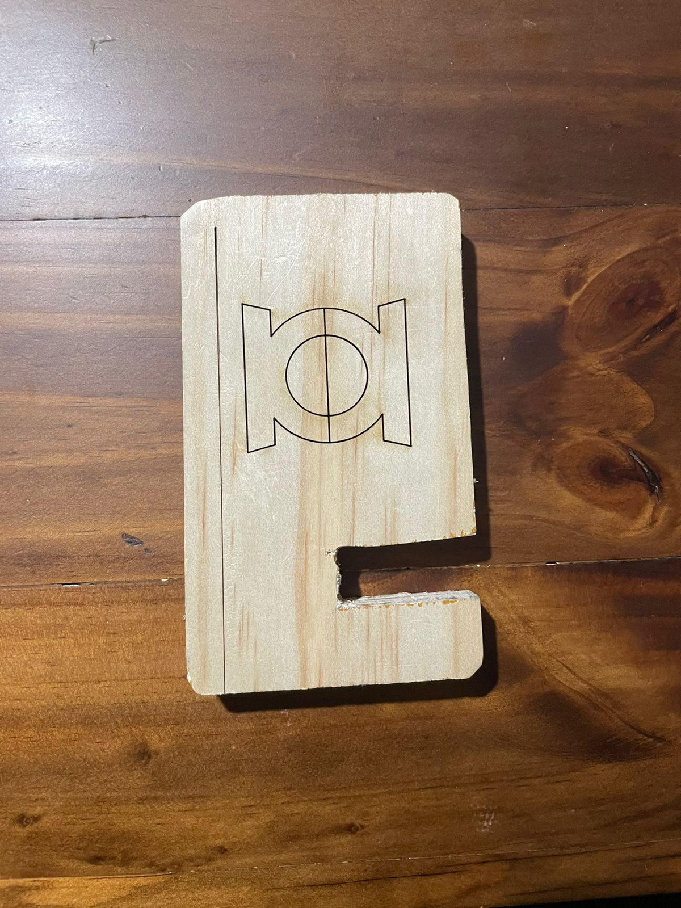
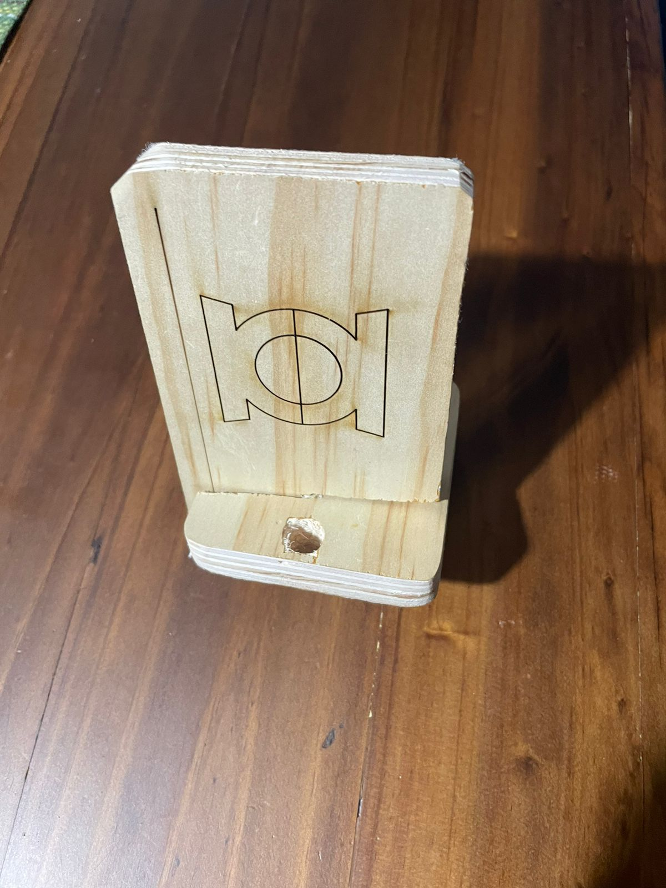

# Corte Láser

Se nos proporcionaron instrucciones e indicaciones para saber utilizar correctamente la máquina de corte láser, de este modo cada quien realizó un ensamble hecho a partir
de un plano creado previamente en 2D en SolidWorks y guardado en formato DXF
---

## Máquina de corte láser
  

Utilizando esta máquina, se realizaron estas dos actividades:

### Corte láser

- Requería mayor potencia y menor velocidad, de tal manera que el láser fuera capaz de penetrar correctamente y cada figura fuera correctamente separada para
más tarde ser ensamblada con las demás.

[Máquina de corte láser](https://drive.google.com/file/d/1BClgl9kDMbyKx0Dt_QMupxRSqQFuPCEq/view?usp=sharing)

### Grabado 

-Por el contrario, esta opción requirió menor potencia pero mayor potencia, de este modo el láser tenía el calor suficiente para grabar y dejar una marca, pero no de cortar toda 
la pieza.

