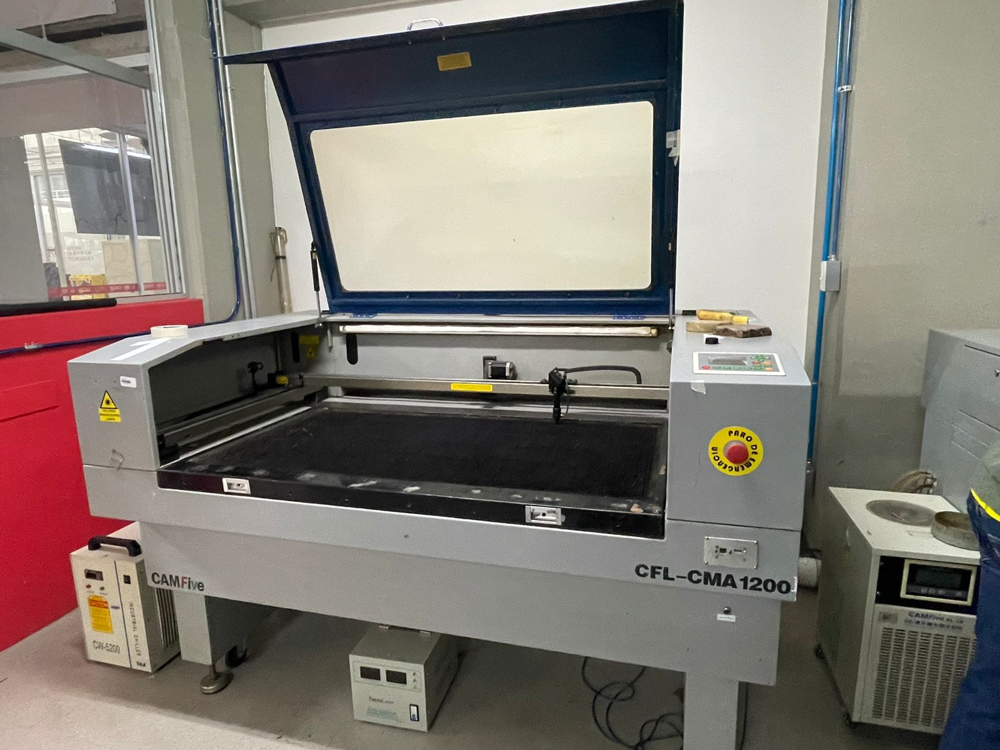

# Corte Láser

Se nos proporcionaron instrucciones e indicaciones para saber utilizar correctamente la máquina de corte láser, de este modo cada quien realizó un ensamble hecho a partir
de un plano creado previamente en 2D en SolidWorks y guardado en formato DXF
---

## Máquina de corte láser
  





## 1) Resumen

- **Nombre del proyecto:** _Mi Proyecto_  
- **Equipo / Autor(es):** _Nombre(s)_  
- **Curso / Asignatura:** _Nombre del curso_  
- **Fecha:** _DD/MM/AAAA_  
- **Descripción breve:** _Una o dos líneas que expliquen qué hace y por qué._

!!! tip "Consejo"
    Mantén este resumen corto (máx. 5 líneas). Lo demás va en secciones específicas.

---

## 2) Objetivos

- **General:** _Qué se pretende lograr en términos amplios._
- **Específicos:**
  - _OE1…_
  - _OE2…_
  - _OE3…_

## 3) Alcance y Exclusiones

- **Incluye:** _Qué funcionalidades/entregables sí están en el proyecto._
- **No incluye:** _Qué queda fuera para evitar malentendidos._

---

## 4) Requisitos

**Software**
- _SO compatible (Windows/Linux/macOS)_
- _Python 3.x / Node 18+ / Arduino IDE / etc._
- _Dependencias (p. ej., pip/requirements, npm packages)_

**Hardware (si aplica)**
- _MCU / Sensores / Actuadores / Fuente de poder_
- _Herramientas (multímetro, cautín, etc.)_

**Conocimientos previos**
- _Programación básica en X_
- _Electrónica básica_
- _Git/GitHub_

---

## 5) Instalación

```bash
# 1) Clonar
git clone https://github.com/<usuario>/<repo>.git
cd <repo>

# 2) (Opcional) Crear entorno virtual
python -m venv .venv
# macOS/Linux
source .venv/bin/activate
# Windows (PowerShell)
.venv\Scripts\Activate.ps1

# 3) Instalar dependencias (ejemplos)
pip install -r requirements.txt
# o, si es Node:
npm install


```
