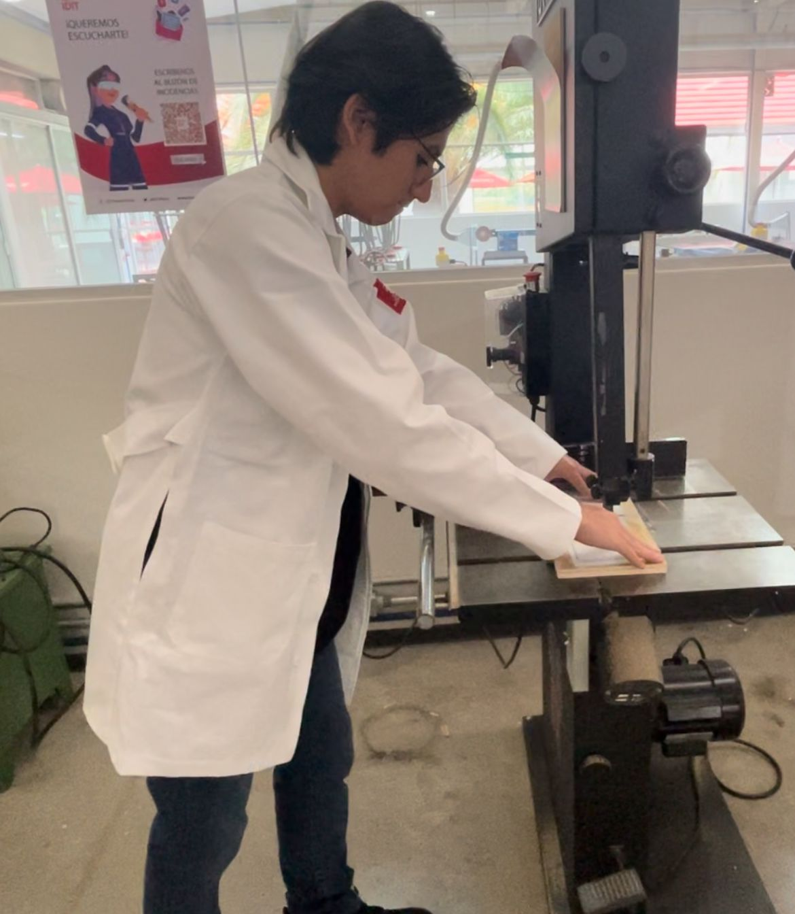

# Máquinas del IDIT

En este apartado se mostraran los trabajos realizados en las máquinas del IDIT, junto con la evidencia fotogáfica del uso de las máquinas.

Este proceso fue con la intención de realizar un porta celulares de madera.

## Resultado de las piezas ya ensambladas


## Vistazo más detallado de las piezas


## Evidencia del uso de la máquina




---

## 1. Clonar un repositorio

Copia un proyecto de GitHub a tu computadora.

```bash
git clone https://github.com/usuario/repositorio.git
```

---

## 2. Verificar cambios

Muestra qué archivos has modificado o agregado.

```bash
git status
```

---

## 3. Preparar cambios

Agrega archivos para guardarlos en el próximo commit.

```bash
git add archivo.txt
git add .   # agrega todos los archivos modificados
```

---

## 4. Guardar cambios (commit)

Guarda tus cambios con un mensaje descriptivo.

```bash
git commit -m "Descripción breve de los cambios"
```

---

## 5. Subir cambios al repositorio (push)

Envía tus commits locales al repositorio en GitHub.

```bash
git push origin main
```

---

## 6. Traer cambios del remoto (pull)

Actualiza tu proyecto con los últimos cambios de GitHub.

```bash
git pull origin main
```

---
## Flujo típico de trabajo


1. **Traer cambios del remoto**  
   ```bash
   git pull origin main
   ```

2. **Editar** tus archivos de proyecto.

3. **Preparar los cambios**  
   ```bash
   git add .
   ```

4. **Guardar los cambios**  
   ```bash
   git commit -m "Mensaje descriptivo"
   ```

5. **Enviar los cambios al remoto**  
   ```bash
   git push origin main
   ```

---

!!! tip "Consejo"
    Piensa en este ciclo como un **loop infinito**:  
    cada vez que quieras contribuir → primero `pull`, después `add` + `commit`, y finalmente `push`.
