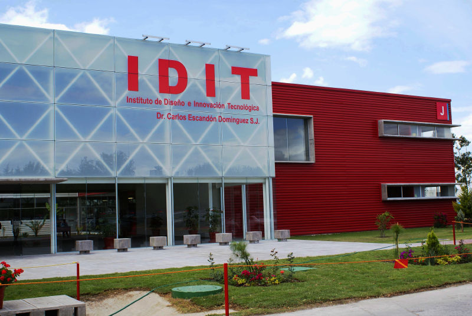

# Proyecto de Ingeniería
## Diego Machorro Lucero
  
¿Quién soy?
 - Mi nombre es Diego, soy un estudiante de 18 años y actualmente me encuentro cursando la carrera de ingeniería en mecatrónica.
 - Desde niño siempre me ha parecido interesante todo lo relacionado con mecanismos y sistemas electrónicos, por lo que desde corta edad tenía idealizado hacia dónde me gustaría llevar mi vida.
 - Algo que me caracteriza es mi gusto e interés por las matemáticas y las ciencias como la física y la biología, ya que encuentro fascinante su enfoque por el descubrimiento y el análisis de todo lo que rodea al ser humano.
---

