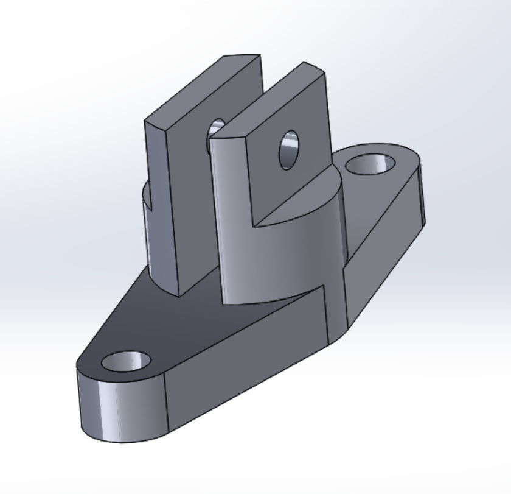

# Proyecto de Ingeniería
## Diego Machorro Lucero
  
## ABOUT

https://view.genially.com/68d08cfa32267797a50dc0f3/personal-branding-about

---

# DENTRO DE ESTE APARTADO SE ENCONTRARAN LOS TRABAJOS REALIZADOS DURANTE EL SEMESTRE

## SYLLABUS

- Introducción a la materia de Proyecto de Ingeniería

https://drive.google.com/drive/folders/1S5LSn4yD73MioJqoT6fgS3_W5G9K9nhp?usp=sharing 

## PIEZAS

- Dentro del programa de Solid Works, se realizaron múltiples piezas utilizando herramientas, desde la realización y diseño del plano 2d, hasta la extrusión a 3d.

- Pieza 1
  

- Pieza 2
  

- Pieza 3
  

- Pieza 4
  

- Pieza Tarea 1
  

-Pieza tarea 2

-Pieza tarea 3

## CLASE PRÁCTICA - PORTACELULARES DE MADERA

- Proceso de cortar madera durante la clase práctica, a fin de contruir un porta celulares, esto a través de distintas máquinas, como un taladro de banco, una lijadora y sierras.

## Corte láser

- Durante esta clase comenzamos a aprender a utilizar la herramienta del corte láser, a fin de crear o grabar distintas figuras
  

